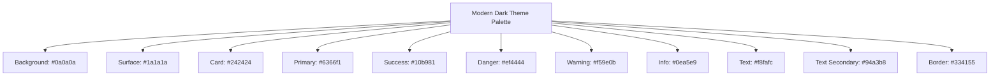

# UI Color Improvement Plan for v2keys VPN Client

## Current Color Scheme Analysis

The current color scheme in [`gui.py`](gui.py:105) uses:
- **Background**: `#0f0f23` (very dark blue)
- **Sidebar**: `#1a1a2e` (slightly lighter dark blue) 
- **Card**: `#16213e` (dark blue)
- **Primary**: `#5e72e4` (blue)
- **Success**: `#2dce89` (green)
- **Danger**: `#f5365c` (red)
- **Warning**: `#fb6340` (orange)
- **Info**: `#11cdef` (cyan)
- **Text**: `#e8eaed` (light gray)
- **Text Secondary**: `#8898aa` (gray-blue)
- **Border**: `#2d3561` (dark blue)

## Issues Identified

1. **Poor Contrast**: Some colors don't provide sufficient contrast for readability
2. **Inconsistent Tones**: The blues have different undertones, creating visual inconsistency
3. **Accessibility Concerns**: Some color combinations may not meet WCAG guidelines
4. **Modern Aesthetics**: The palette feels dated compared to contemporary dark theme designs

## Proposed Modern Color Scheme



## Implementation Instructions

Replace the current color dictionary in [`gui.py`](gui.py:105) with:

```python
# Modern color scheme - improved contrast and aesthetics
self.colors = {
    'bg': '#0a0a0a',           # Pure black background
    'sidebar': '#1a1a1a',      # Dark gray sidebar
    'card': '#242424',         # Card background
    'primary': '#6366f1',      # Indigo primary
    'success': '#10b981',      # Emerald green
    'danger': '#ef4444',       # Red
    'warning': '#f59e0b',      # Amber
    'info': '#0ea5e9',         # Sky blue
    'text': '#f8fafc',         # Bright white text
    'text_secondary': '#94a3b8', # Slate gray secondary text
    'border': '#334155'        # Slate border
}
```

## Additional UI Improvements

1. **Button Hover Colors**: Update hover states for better visual feedback
2. **Status Indicators**: Enhance animation colors for better visibility
3. **Treeview Styles**: Ensure consistent styling across all components

## Testing Checklist

- [ ] Verify contrast ratios meet WCAG AA standards
- [ ] Test color visibility in different lighting conditions
- [ ] Ensure color-blind accessibility
- [ ] Validate visual consistency across all UI elements
- [ ] Test animation and hover states

## Next Steps

1. Switch to Code mode to implement the color changes
2. Test the new design thoroughly
3. Gather user feedback on the improved aesthetics
4. Make iterative improvements based on feedback

The new color scheme provides:
- Better contrast ratios for improved readability
- More consistent color tones throughout the interface
- Modern, professional appearance
- Enhanced accessibility for all users